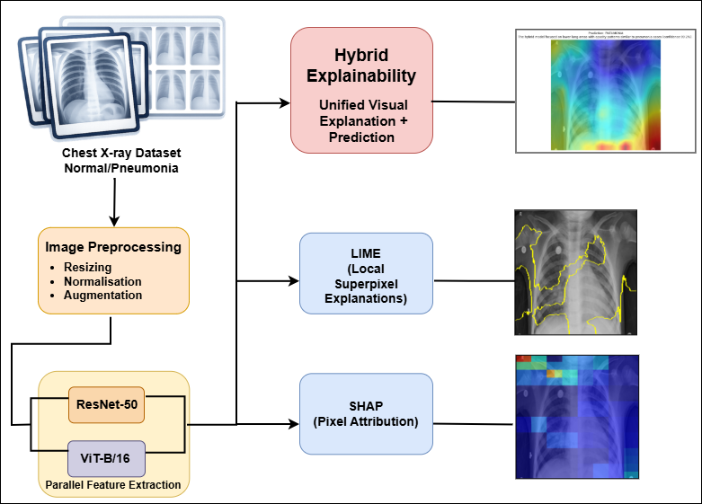
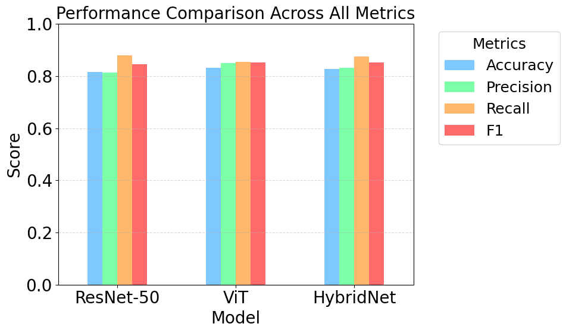
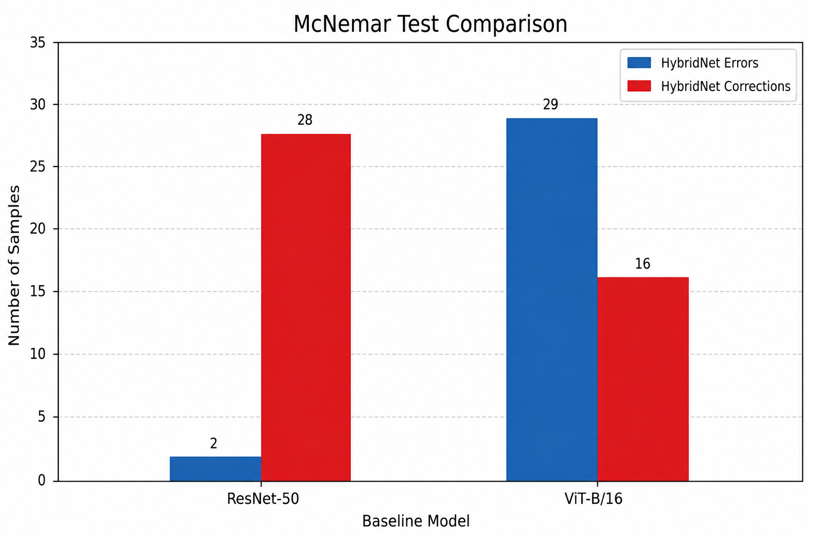
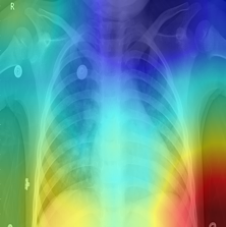
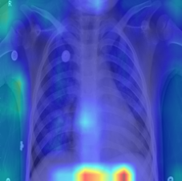
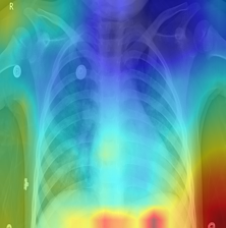
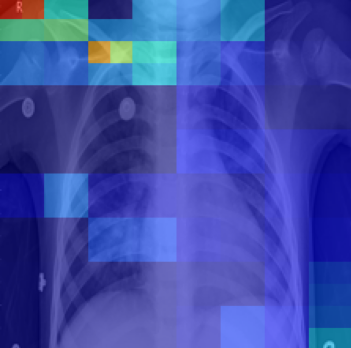
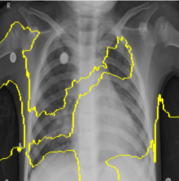
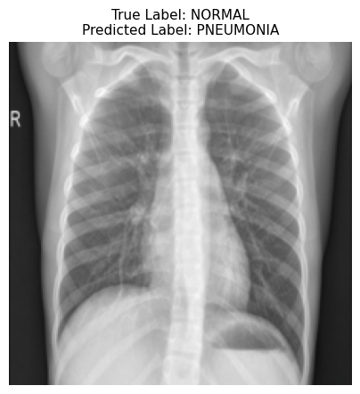

# XAI-HybridNet

## Trustworthy Hybrid CNN–Transformer Framework for Explainable Medical Image Analysis

XAI-HybridNet is a unified explainability-oriented deep learning framework designed for interpretable pneumonia detection from pediatric chest X-ray images. The framework combines the localized spatial learning capability of CNNs with the global contextual reasoning strengths of Vision Transformers through weighted ensemble fusion and multimodal explainability integration.

The proposed framework integrates:
- ResNet-50 and ViT-B/16 hybrid ensemble learning
- Grad-CAM and Guided Grad-CAM localization
- Vision Transformer attention visualization
- SHAP and LIME model-agnostic explanations
- Hybrid multimodal explanation fusion
- Cross-method explainability reliability evaluation using XCS and X-Entropy metrics

---

# Architecture Overview

  

The framework combines:
1. Image preprocessing and augmentation
2. Parallel feature extraction using ResNet-50 and ViT-B/16
3. Weighted probability fusion
4. Hybrid explainability generation
5. Cross-method reliability and consensus evaluation

---

# Experimental Datasets

The framework was evaluated using two publicly available pediatric chest X-ray datasets.

| Dataset | Normal | Pneumonia | Total | Contribution |
|---|---|---|---|---|
| Kaggle Chest X-ray | 1,583 | 4,273 | 5,856 | 69.4% |
| Mendeley Chest X-ray | 1,320 | 1,306 | 2,626 | 31.1% |
| **Combined Dataset** | **2,895** | **5,541** | **8,436** | **100%** |

## Dataset Sources

### Kaggle Pediatric Chest X-ray Dataset
https://www.kaggle.com/datasets/paultimothymooney/chest-xray-pneumonia

### Mendeley Chest X-ray Dataset
https://data.mendeley.com/datasets/wndbd5r26y/3

---

# Performance Evaluation

## Quantitative Performance Comparison

  

| Model | Accuracy | Precision | Recall | F1-score |
|---|---|---|---|---|
| ResNet-50 | 0.816 | 0.813 | 0.879 | 0.845 |
| ViT-B/16 | 0.832 | 0.851 | 0.854 | 0.853 |
| **HybridNet (Proposed)** | **0.845** | **0.855** | **0.875** | **0.859** |

The proposed XAI-HybridNet framework achieved improved predictive stability and balanced classification performance while maintaining strong recall characteristics important for pneumonia detection tasks.

---

# Statistical Significance Analysis

## McNemar Test Comparison

  

The McNemar statistical analysis demonstrates comparative disagreement distributions between HybridNet and the baseline architectures, supporting the evaluation of predictive robustness and ensemble consistency.

---

# Explainability Outputs

## Grad-CAM Visualization

  

Grad-CAM highlights localized pulmonary regions contributing strongly to the classification decision.

---

## Vision Transformer Attention Map

  

ViT attention visualization captures broader global contextual dependencies across chest radiographs.

---

## Hybrid Attention Fusion

  

The hybrid attention map combines CNN localization with transformer contextual reasoning to produce smoother and more coherent explanations.

---

## SHAP Attribution Analysis

  

SHAP provides pixel-level attribution analysis for model-agnostic interpretability assessment.

---

## LIME Superpixel Explanation

  

LIME generates local superpixel explanations that highlight clinically relevant image regions influencing predictions.

---

# Failure Case Analysis

  

Representative failure cases indicate that subtle pulmonary intensity variations and overlapping anatomical structures may occasionally resemble pneumonia-related opacity patterns, resulting in false-positive predictions.

---

# Installation

Clone the repository:

    git clone https://github.com/nomadcodin/XAI_HybridNet.git
    cd XAI_HybridNet

Install required dependencies:

    pip install -r requirements.txt

Recommended environment:
- Python 3.10+
- PyTorch
- torchvision
- timm
- OpenCV
- SHAP
- LIME
- scikit-learn
- matplotlib

---

# Usage

## Main Training and Explainability Pipeline

Run:

    jupyter notebook notebooks/XAI_HybridNet.ipynb

This notebook includes:
- dataset preprocessing
- data augmentation
- ResNet-50 training
- ViT-B/16 training
- weighted ensemble fusion
- explainability generation
- hybrid explanation visualization

---

## Metrics and Statistical Analysis

Run:

    jupyter notebook notebooks/Hybridnet_metrics.ipynb

This notebook performs:
- metric computation
- XCS and X-Entropy evaluation
- consensus and stability analysis
- McNemar significance testing
- visualization generation

---

# Repository Structure

    XAI_HybridNet/
    │
    ├── notebooks/
    │   ├── Computational_Analysis.ipynb
    │   ├── Hybridnet_metrics.ipynb
    │   ├── XAI_HybridNet.ipynb
    │   └── README.md
    │
    ├── results/
    │   ├── architecture/
    │   ├── consensus_stability/
    │   ├── explainability/
    │   ├── failure_cases/
    │   ├── performance/
    │   └── RESULTS.md
    │
    └── README.md

---

# References

1. He, K., Zhang, X., Ren, S., and Sun, J. *Deep Residual Learning for Image Recognition*. Proceedings of the IEEE Conference on Computer Vision and Pattern Recognition (CVPR), 2016.

2. Dosovitskiy, A., et al. *An Image is Worth 16×16 Words: Transformers for Image Recognition at Scale*. ICLR, 2021.

3. Selvaraju, R. R., et al. *Grad-CAM: Visual Explanations from Deep Networks via Gradient-Based Localization*. ICCV, 2017.

4. Ribeiro, M. T., Singh, S., and Guestrin, C. *Why Should I Trust You?: Explaining the Predictions of Any Classifier*. KDD, 2016.

5. Lundberg, S. M., and Lee, S. I. *A Unified Approach to Interpreting Model Predictions*. NeurIPS, 2017.

6. Rajpurkar, P., et al. *CheXNet: Radiologist-Level Pneumonia Detection on Chest X-rays with Deep Learning*. arXiv preprint arXiv:1711.05225, 2017.

7. Raghu, M., et al. *Do Vision Transformers See Like Convolutional Neural Networks?* NeurIPS, 2021.

8. Tjoa, E., and Guan, C. *A Survey on Explainable Artificial Intelligence (XAI): Toward Medical XAI*. IEEE Transactions on Neural Networks and Learning Systems, 2020.

9. Angara, S., et al. *A Novel Method to Enhance Pneumonia Detection via a Model-Level Ensembling of CNN and Vision Transformer*. arXiv preprint arXiv:2401.02358, 2024.

10. Amirian, S., et al. *State-of-the-Art in Responsible, Explainable, and Fair AI for Medical Image Analysis*. IEEE Access, 2025.

---

# Future Work

Future extensions of the proposed framework will focus on:
- multi-class thoracic disease classification
- broader multi-institutional validation
- domain adaptation under distributional shifts
- uncertainty-aware prediction mechanisms
- clinician-in-the-loop validation
- deployment-oriented optimization
- advanced language-based explanation generation
- broader explainability benchmarking in safety-critical environments

